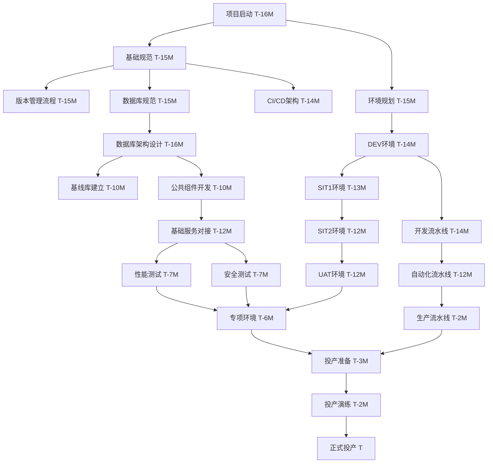

# 通用架构管理全生命周期待办任务清单 v1.1

## 文档信息
- 文档版本：v1.1
- 编写日期：2026-06-20
- 项目周期：T-16个月 至 T（16个月）
- v1.1更新：Excel配置模板、交付物清单、依赖关系、风险识别

---

## v1.0 内容回顾

详见 `universal-lifecycle-tasks.md`，包含175项任务，分为11大类。

---

## 一、Excel配置模板（配置管理标准化）

### 1.1 环境资源配置模板

**文件名**：`环境资源清单_T{版本}.xlsx`

| Sheet页 | 字段名称 | 说明 | 示例值 |
|---------|----------|------|--------|
| 环境概览 | 序号 | 环境序号 | 1, 2, 3... |
| 环境概览 | 环境分类 | 环境类型 | 开发/测试/生产 |
| 环境概览 | 环境名称 | 具体环境名 | DEV_SIT1_SIT2_UAT_PERF |
| 环境概览 | 生命周期 | 使用时间范围 | T-16M至T |
| 环境概览 | 关联系统 | 依赖的系统名称 | OA/征信/支付 |
| 环境概览 | 搭建状态 | 部署状态 | 待部署/部署中/已完成 |
| 环境概览 | 预计使用时间 | 计划使用时间 | T-15M |
| 环境概览 | 优先级 | 环境重要性 | P0/P1/P2 |
| 服务器资源 | 服务器IP | 服务器IP地址 | 192.168.1.100 |
| 服务器资源 | 操作系统 | OS版本 | CentOS7.9 |
| 服务器资源 | CPU(核) | CPU核数 | 8核 |
| 服务器资源 | 内存(GB) | 内存大小 | 32GB |
| 服务器资源 | 存储(GB) | 磁盘大小 | 500GB |
| 服务器资源 | 部署服务 | 部署的应用服务 | user-service |
| 服务器资源 | JDK版本 | Java版本 | JDK1.8/OpenJDK11 |
| 服务器资源 | 宝蓝德版本 | 应用服务器版本 | TongWeb7.0 |
| 数据库资源 | 数据库类型 | 数据库类型 | MySQL/OB/GoldenDB |
| 数据库资源 | 数据库名称 | 数据库名称 | credit_main |
| 数据库资源 | 实例类型 | 实例类型 | 主节点/从节点 |
| 数据库资源 | 实例名称 | 实例名称 | db_instance_01 |
| 数据库资源 | 链接地址 | 连接地址 | jdbc:mysql://ip:3306 |
| 数据库资源 | 资源配置 | 资源配置 | 16C64G |
| 数据库资源 | 数据量 | 数据量大小 | 100GB |
| 数据库资源 | 业务用户 | 业务账号 | credit_app |
| 数据库资源 | 业务密码 | 业务密码 | ******** |
| 中间件资源 | 中间件类型 | 中间件类型 | Redis/Nacos/Nginx |
| 中间件资源 | 实例数量 | 实例数量 | 3 |
| 中间件资源 | 规格 | 配置规格 | 4C8G |
| 网络资源 | 域名 | 域名 | api.example.com |
| 网络资源 | SLB | 负载均衡 | slb-api-01 |
| 网络资源 | HTTPS | 是否HTTPS | 是/否 |
| 网络资源 | 证书 | 证书名称 | ssl-cert-2025 |
| 关联系统配置 | 系统名称 | 关联系统名 | OA系统 |
| 关联系统配置 | 环境映射 | 环境对应关系 | DEV→DEV_SIT1→UAT |
| 关联系统配置 | IP/域名 | 地址信息 | oa.internal.com |
| 关联系统配置 | 配置参数 | 关键参数 | 机构代码/系统ID |

### 1.2 Nacos配置模板

**文件名**：`Nacos配置清单_T{版本}.xlsx`

| Sheet页 | 字段名称 | 说明 | 示例值 |
|---------|----------|------|--------|
| 配置概览 | 序号 | 配置序号 | 1, 2, 3... |
| 配置概览 | 环境 | 环境名称 | DEV/SIT1/SIT2/UAT |
| 配置概览 | 服务名 | 微服务名称 | user-service |
| 配置概览 | 配置文件 | 配置文件名 | application.yml |
| 配置概览 | 配置状态 | 配置状态 | 待配置/已配置 |
| 配置详情 | 参数Key | 参数键 | spring.datasource.url |
| 配置详情 | 参数Value | 参数值 | jdbc:mysql://db:3306 |
| 配置详情 | 参数类型 | 参数类型 | String/Integer |
| 配置详情 | 默认值 | 默认值 | default_value |
| 配置详情 | 是否敏感 | 是否敏感 | 是/否 |
| 配置详情 | 说明 | 参数说明 | 数据库连接地址 |
| 配置详情 | 变更日期 | 最后变更时间 | 2025-12-01 |

### 1.3 Nginx配置模板

**文件名**：`Nginx配置清单_T{版本}.xlsx`

| Sheet页 | 字段名称 | 说明 | 示例值 |
|---------|----------|------|--------|
| 配置概览 | 序号 | 配置序号 | 1, 2, 3... |
| 配置概览 | 环境 | 环境名称 | DEV/SIT1/SIT2/UAT |
| 配置概览 | 服务名 | 微服务名称 | user-gateway |
| 配置概览 | 配置文件 | 配置文件名 | nginx.conf |
| 配置概览 | 配置状态 | 配置状态 | 待配置/已配置 |
| 配置详情 | server_name | 服务器名称 | api.example.com |
| 配置详情 | listen | 监听端口 | 80/443 |
| 配置详情 | location | 路由路径 | /api/user |
| 配置详情 | proxy_pass | 代理地址 | http://user-service |
| 配置详情 | upstream | 上游服务器 | user-service:8080 |
| 配置详情 | ssl | SSL配置 | ssl_certificate |
| 配置详情 | 说明 | 配置说明 | 用户服务网关配置 |

### 1.4 数据库配置模板

**文件名**：`数据库参数清单_T{版本}.xlsx`

| Sheet页 | 字段名称 | 说明 | 示例值 |
|---------|----------|------|--------|
| 配置概览 | 序号 | 配置序号 | 1, 2, 3... |
| 配置概览 | 环境 | 环境名称 | DEV/SIT1/SIT2/UAT |
| 配置概览 | 数据库名称 | 数据库名称 | credit_main |
| 配置概览 | 配置类型 | 配置类型 | 连接参数/服务端/客户端 |
| 配置详情 | 参数Key | 参数键 | ob_query_timeout |
| 配置详情 | 参数Value | 参数值 | 1000000000 |
| 配置详情 | 参数类型 | 参数类型 | Integer |
| 配置详情 | 默认值 | 默认值 | 10000000 |
| 配置详情 | 最小值 | 最小值 | 1000000 |
| 配置详情 | 最大值 | 最大值 | 1000000000 |
| 配置详情 | 单位 | 单位 | us/MB |
| 配置详情 | 说明 | 参数说明 | 查询超时时间 |

### 1.5 基础数据配置模板

**文件名**：`基础数据初始化清单_T{版本}.xlsx`

| Sheet页 | 字段名称 | 说明 | 示例值 |
|---------|----------|------|--------|
| 数据概览 | 序号 | 数据序号 | 1, 2, 3... |
| 数据概览 | 表名称 | 表名 | sys_user |
| 数据概览 | 数据类型 | 数据类型 | 基础参数/业务参数 |
| 数据概览 | 所属模块 | 所属模块 | 用户管理 |
| 数据概览 | 是否初始化 | 是否需要初始化 | 是/否 |
| 数据概览 | 数据量 | 数据量 | 100条 |
| 数据概览 | 数据来源 | 数据来源 | 需求组/开发组 |
| 数据详情 | 参数Key | 参数键 | system.default.tenant |
| 数据详情 | 参数Value | 参数值 | DEFAULT_TENANT |
| 数据详情 | 参数说明 | 参数说明 | 默认租户代码 |
| 数据详情 | 变更责任人 | 责任人 | 张三 |
| 数据详情 | 变更日期 | 变更时间 | 2025-12-01 |
| 数据详情 | 审核状态 | 审核状态 | 待审核/已审核 |

### 1.6 版本发布配置模板

**文件名**：`版本发布登记表_T{版本}.xlsx`

| Sheet页 | 字段名称 | 说明 | 示例值 |
|---------|----------|------|--------|
| 发布概览 | 发布编号 | 发布编号 | REL-2025-12-01-001 |
| 发布概览 | 发布日期 | 发布日期 | 2025-12-01 |
| 发布概览 | 发布环境 | 发布环境 | SIT1/SIT2/UAT |
| 发布概览 | 发布类型 | 发布类型 | 紧急发布/计划发布 |
| 发布概览 | 发布状态 | 发布状态 | 待发布/已发布/已回退 |
| 发布详情 | 模块名称 | 模块名称 | 用户中心 |
| 发布详情 | 版本号 | 版本号 | v1.0.0 |
| 发布详情 | 提交人 | 提交人 | 张三 |
| 发布详情 | 提交时间 | 提交时间 | 2025-12-01 10:00 |
| 发布详情 | 审核人 | 审核人 | 李四 |
| 发布详情 | 审核时间 | 审核时间 | 2025-12-01 14:00 |
| 发布详情 | 发布说明 | 发布说明 | 修复用户登录问题 |
| 发布详情 | 回退版本 | 回退版本号 | v0.9.9 |
| 发布详情 | 回退说明 | 回退原因 | 存在严重bug |

---

## 二、交付物清单（按里程碑）

### 里程碑 M1：项目启动（T-16M）

| 序号 | 交付物名称 | 文件格式 | 负责人 | 验收标准 |
|------|------------|----------|--------|----------|
| M1-001 | 《架构管理总体计划》 | Word/Excel | 项目经理 | 包含时间节点、里程碑、风险 |
| M1-002 | 《环境现状调研报告》 | Word/Excel | DevOps | 包含现有资源情况 |
| M1-003 | 《行方需求沟通纪要》 | Word | 架构师 | 包含技术、安全、运维要求 |
| M1-004 | 《中电协作机制文档》 | Word | DevOps | 包含协作范围、响应机制 |
| M1-005 | 《环境资源申请清单》 | Excel | DevOps | 包含所需资源详情 |
| M1-006 | 《里程碑M1评审报告》 | Word | 项目经理 | 包含评审意见、签字确认 |

### 里程碑 M2：基础规范（T-15M）

| 序号 | 交付物名称 | 文件格式 | 负责人 | 验收标准 |
|------|------------|----------|--------|----------|
| M2-001 | 《分支管理规范文档》 | Word | 版本管理员 | 包含分支策略、命名规范 |
| M2-002 | 《前后端分支命名对照表》 | Excel | 版本管理员 | 包含前后端对应关系 |
| M2-003 | 《Git提交规范》 | Word | 版本管理员 | 包含提交格式、内容要求 |
| M2-004 | pre-commit hook脚本 | Shell/Python | DevOps | 可执行、自动检查 |
| M2-005 | 《多环境发版管理规范》 | Word | 版本管理员 | 包含发版时间、通知、审批 |
| M2-006 | 《发版日历模板》 | Excel | 版本管理员 | 可填写发版计划 |
| M2-007 | 《数据库脚本开发与部署规范》 | Word | DBA | 包含四段式脚本规范 |
| M2-008 | 《版本管理员操作手册》 | Word | 版本管理员 | 包含检查流程、操作步骤 |
| M2-009 | 《CI/CD架构设计文档》 | Word/Drawio | DevOps | 包含流水线架构图 |
| M2-010 | 《系统开发技术规范》 | Word | 架构师 | 包含代码规范、注释规范 |
| M2-011 | master分支自动合并任务配置 | Shell/Crontab | DevOps | 每日21:00自动执行 |
| M2-012 | SonarQube代码检查配置 | Shell/Xml | DevOps | 已配置并可检查 |
| M2-013 | 《里程碑M2评审报告》 | Word | 项目经理 | 包含评审意见、签字确认 |

### 里程碑 M3：环境搭建（T-13M）

| 序号 | 交付物名称 | 文件格式 | 负责人 | 验收标准 |
|------|------------|----------|--------|----------|
| M3-001 | DEV环境（完整交付） | - | DevOps | 环境可用、验收通过 |
| M3-002 | SIT1环境（完整交付） | - | DevOps | 环境可用、验收通过 |
| M3-003 | SIT2环境（完整交付） | - | DevOps | 环境可用、验收通过 |
| M3-004 | UAT环境（完整交付） | - | DevOps | 环境可用、验收通过 |
| M3-005 | 《环境资源清单》 | Excel | DevOps | 包含所有环境资源详情 |
| M3-006 | 《Maven私服管理方案》 | Word | DevOps | 包含私服隔离方案 |
| M3-007 | 《Nacos配置规范》 | Word | DevOps | 包含配置管理流程 |
| M3-008 | 《Nginx配置规范》 | Word | DevOps | 包含配置管理流程 |
| M3-009 | 《数据库参数配置标准》 | Word | DBA | 包含客户端/服务端参数 |
| M3-010 | 《数据库客户端参数标准》 | Word | DBA | 包含客户端连接参数 |
| M3-011 | 《Gitlab备份方案》 | Word | DevOps | 包含备份、恢复流程 |
| M3-012 | 环境部署自动化脚本 | Shell/Python | DevOps | 可执行、验证通过 |
| M3-013 | 《开发环境部署实施手册》 | Word | DevOps | 可按步骤执行 |
| M3-014 | 《环境部署验收标准》 | Word | DevOps | 包含验收检查项 |
| M3-015 | 《环境交付验收报告》 | Word | DevOps | 包含验收结果、签字确认 |
| M3-016 | 《网络拓扑分析报告》 | Word/Visio | DevOps | 包含网络架构图 |
| M3-017 | 《环境初始化任务跟踪表》 | Excel | DevOps | 包含部署步骤、负责人 |
| M3-018 | 《里程碑M3评审报告》 | Word | 项目经理 | 包含评审意见、签字确认 |

### 里程碑 M4：数据库架构（T-10M）

| 序号 | 交付物名称 | 文件格式 | 负责人 | 验收标准 |
|------|------------|----------|--------|----------|
| M4-001 | 《数据库设计文档标准》 | Word | DBA | 包含表结构、字段标准 |
| M4-002 | 《数据标准文档》 | Word | 数据架构师 | 包含数据类型、长度标准 |
| M4-003 | 《数据字典管理规范》 | Word | 版本管理员 | 包含字典管理流程 |
| M4-004 | 《基准数据库设计方案》 | Word | DBA | 包含基线库架构 |
| M4-005 | 《基础参数分类清单》 | Excel | 数据架构师 | 包含初始化参数 |
| M4-006 | 《初始化数据库表清单》 | Excel | 数据架构师 | 包含初始化表 |
| M4-007 | 《查询库表清单》 | Excel | DBA | 包含查询库表 |
| M4-008 | 《静态库表清单》 | Excel | DBA | 包含静态库表 |
| M4-009 | 数据库差异检查脚本 | Shell/Python | DBA | 可执行、验证通过 |
| M4-010 | 《数据库分区策略设计》 | Word | DBA | 包含分区键、策略 |
| M4-011 | 《数据库清理策略设计》 | Word | DBA | 包含清理、归档策略 |
| M4-012 | 《OSS清理归档策略》 | Word | DBA | 包含OSS归档方案 |
| M4-013 | 基线数据库（版本1.2） | - | DBA | 数据完整、验证通过 |
| M4-014 | 基线库数据导出导入脚本 | Shell/Python | DevOps | 可执行、验证通过 |
| M4-015 | 《基础数据管理流程》 | Word | DBA | 包含变更流程 |
| M4-016 | 《基础数据变更管理规范》 | Word | 版本管理员 | 包含审批流程 |
| M4-017 | 《基线数据库版本管理方案》 | Word | DBA | 包含版本升级流程 |
| M4-018 | 《配置版本管理规范》 | Word | DevOps | 包含配置管理流程 |
| M4-019 | 修订版《开发环境部署实施手册》 | Word | DevOps | 可按步骤执行 |
| M4-020 | 《环境测试搭建计划》 | Word | DevOps | 包含专项环境计划 |
| M4-021 | 环境参数Excel文件（各环境） | Excel | DevOps | 按环境分类 |
| M4-022 | 《里程碑M4评审报告》 | Word | 项目经理 | 包含评审意见、签字确认 |

### 里程碑 M5：公共组件（T-8M）

| 序号 | 交付物名称 | 文件格式 | 负责人 | 验收标准 |
|------|------------|----------|--------|----------|
| M5-001 | 缓存公共组件（已发布到私服） | JAR | 开发 | 可引用、文档齐全 |
| M5-002 | 幂等公共组件（已发布到私服） | JAR | 开发 | 可引用、文档齐全 |
| M5-003 | 分布式事务组件（已发布到私服） | JAR | 开发 | 可引用、文档齐全 |
| M5-004 | 分布式锁组件（已发布到私服） | JAR | 开发 | 可引用、文档齐全 |
| M5-005 | 防重交易组件（已发布到私服） | JAR | 开发 | 可引用、文档齐全 |
| M5-006 | 上传下载公共组件（已发布到私服） | JAR | 开发 | 可引用、文档齐全 |
| M5-007 | 影像公共组件（已发布到私服） | JAR | 开发 | 可引用、文档齐全 |
| M5-008 | 电子文档组件（已发布到私服） | JAR | 开发 | 可引用、文档齐全 |
| M5-009 | 审批授权组件（已发布到私服） | JAR | 开发 | 可引用、文档齐全 |
| M5-010 | 《公共组件使用手册》 | Word | 架构师 | 包含所有组件使用说明 |
| M5-011 | 《系统开发技术手册》 | Word | 架构师 | 包含组件使用说明 |
| M5-012 | 《里程碑M5评审报告》 | Word | 项目经理 | 包含评审意见、签字确认 |

### 里程碑 M6：基础服务（T-8M）

| 序号 | 交付物名称 | 文件格式 | 负责人 | 验收标准 |
|------|------------|----------|--------|----------|
| M6-001 | 《统一认证对接方案》 | Word | 架构师 | 包含接入方案、接口设计 |
| M6-002 | 《统一日志对接方案》 | Word | DevOps | 包含接入方案、日志格式 |
| M6-003 | 《统一调度对接方案》 | Word | DevOps | 包含接入方案、调度接口 |
| M6-004 | 《统一监控对接方案》 | Word | DevOps | 包含监控指标、告警规则 |
| M6-005 | 《统一异常交易码管理方案》 | Word | 架构师 | 包含异常分类、管理流程 |
| M6-006 | 《7*24小时功能设计方案》 | Word | 架构师 | 包含灰度、蓝绿、弹性扩展 |
| M6-007 | 《日志埋点设计文档》 | Word | 性能工程师 | 包含埋点方案、格式标准 |
| M6-008 | 《分批上线方案》 | Word | DevOps | 包含批次划分、切换策略 |
| M6-009 | 日志埋点收集工具 | Shell/Java | 性能工程师 | 可执行、验证通过 |
| M6-010 | 《基础服务使用手册》 | Word | DevOps | 包含所有服务使用说明 |
| M6-011 | 《里程碑M6评审报告》 | Word | 项目经理 | 包含评审意见、签字确认 |

### 里程碑 M7：非功能需求（T-8M）

| 序号 | 交付物名称 | 文件格式 | 负责人 | 验收标准 |
|------|------------|----------|--------|----------|
| M7-001 | 《缓存方案设计》 | Word | 架构师 | 包含缓存策略、更新机制 |
| M7-002 | 《多法人方案设计》 | Word | 架构师 | 包含数据隔离、配置管理 |
| M7-003 | 《批量调度方案设计》 | Word | 架构师 | 包含调度架构、依赖关系 |
| M7-004 | 《账务一致性方案设计》 | Word | 架构师 | 包含对账方案、补偿机制 |
| M7-005 | 《容错方案设计》 | Word | 架构师 | 包含熔断、限流、降级 |
| M7-006 | 《日志审计方案设计》 | Word | 架构师 | 包含审计日志、采集方案 |
| M7-007 | 《移动端安全防护方案设计》 | Word | 安全工程师 | 包含加密、防篡改 |
| M7-008 | 《移动端兼容方案设计》 | Word | 架构师 | 包含浏览器、设备适配 |
| M7-009 | 《系统架构设计方案》 | Word | 架构师 | 包含架构图、技术方案 |
| M7-010 | 最终版《系统开发技术规范》 | Word | 架构师 | 包含所有技术规范 |
| M7-011 | 《里程碑M7评审报告》 | Word | 项目经理 | 包含评审意见、签字确认 |

### 里程碑 M8：性能测试（T-4M）

| 序号 | 交付物名称 | 文件格式 | 负责人 | 验收标准 |
|------|------------|----------|--------|----------|
| M8-001 | 《性能测试需求》 | Word | 性能工程师 | 包含压测范围、指标 |
| M8-002 | 《性能测试方案》 | Word | 性能工程师 | 包含测试计划、场景 |
| M8-003 | 性能测试报告（签字盖章） | PDF | 性能工程师 | 包含测试结果、分析 |
| M8-004 | 慢SQL收集-修复-跟踪机制 | - | 性能工程师 | 闭环管理流程 |
| M8-005 | 慢接口收集-修复-跟踪机制 | - | 性能工程师 | 闭环管理流程 |
| M8-006 | 《性能测试环境准备报告》 | Word | DevOps | 环境可用、数据准备 |
| M8-007 | 《里程碑M8评审报告》 | Word | 项目经理 | 包含评审意见、签字确认 |

### 里程碑 M9：安全测试（T-4M）

| 序号 | 交付物名称 | 文件格式 | 负责人 | 验收标准 |
|------|------------|----------|--------|----------|
| M9-001 | 《安全测试需求》 | Word | 安全工程师 | 包含测试范围、场景 |
| M9-002 | 《安全测试方案》 | Word | 安全工程师 | 包含测试计划、方法 |
| M9-003 | 安全测试报告（签字盖章） | PDF | 安全工程师 | 包含测试结果、修复 |
| M9-004 | 《安全扫描报告》 | Excel/PDF | 安全工程师 | 包含漏洞清单、修复状态 |
| M9-005 | 《里程碑M9评审报告》 | Word | 项目经理 | 包含评审意见、签字确认 |

### 里程碑 M10：投产准备（T-1M）

| 序号 | 交付物名称 | 文件格式 | 负责人 | 验收标准 |
|------|------------|----------|--------|----------|
| M10-001 | 《投产演练环境部署手册》 | Word | DevOps | 可按步骤执行 |
| M10-002 | 《环境初始化任务跟踪表》 | Excel | DevOps | 包含部署步骤、负责人 |
| M10-003 | 《投产演练技术验证方案》 | Word | DevOps | 包含验证方法、脚本 |
| M10-004 | 技术验证脚本 | Shell/Python | DevOps | 可执行、验证通过 |
| M10-005 | 《分批上线计划表》 | Excel | 项目经理 | 包含批次、时间、内容 |
| M10-006 | 《投产演练方案》 | Word | DevOps | 包含演练步骤、人员 |
| M10-007 | 《投产应急预案》 | Word | DevOps | 包含应急场景、回退方案 |
| M10-008 | 《投产演练实施分时步骤》 | Word | DevOps | 包含详细时序、操作 |
| M10-009 | 《全行级投产实施分时计划》 | Word | DevOps | 包含全行级时序 |
| M10-010 | 《新信贷系统开发运维手册》 | Word | DevOps | 包含运维操作、问题处理 |
| M10-011 | 最终版《系统架构设计方案》 | Word | 架构师 | 包含最终架构、技术方案 |
| M10-012 | 最终版《系统开发技术规范》 | Word | 架构师 | 包含最终技术规范 |
| M10-013 | 《投产演练准备检查报告》 | Word | 版本管理员 | 包含检查项、结果 |
| M10-014 | 《里程碑M10评审报告》 | Word | 项目经理 | 包含评审意见、签字确认 |

### 里程碑 M11：上线完成（T）

| 序号 | 交付物名称 | 文件格式 | 负责人 | 验收标准 |
|------|------------|----------|--------|----------|
| M11-001 | 投产演练复盘报告（3份） | Word | DevOps | 包含问题分析、改进措施 |
| M11-002 | 《投产前最终检查报告》 | Word | 版本管理员 | 包含检查项、结果 |
| M11-003 | 投产报告（3份） | Word | DevOps | 包含部署步骤、验证结果 |
| M11-004 | 上线验证报告 | Word | 测试 | 包含功能、性能验证 |
| M11-005 | 《项目验收报告》 | Word | 项目经理 | 包含验收结果、签字确认 |
| M11-006 | 《项目总结报告》 | Word | 项目经理 | 包含经验、教训、最佳实践 |
| M11-007 | 《里程碑M11评审报告》 | Word | 项目经理 | 包含评审意见、签字确认 |

---

## 三、依赖关系细化

### 3.1 核心依赖关系图



### 3.2 关键路径依赖

#### 路径1：环境搭建关键路径
```
T-15M: 环境规划 → T-14M: DEV环境 → T-13M: SIT1环境 → T-12M: SIT2/UAT环境 → T-2M: 演练环境 → T: 生产环境
```

**关键依赖**：
- DEV环境必须在T-14M完成，否则影响开发进度
- SIT2环境必须在T-12M完成，否则影响集成测试
- 演练环境必须在T-2M完成，否则影响投产演练

#### 路径2：数据库关键路径
```
T-16M: 数据库规范 → T-14M: 差异检查工具 → T-12M: 检查脚本部署 → T-10M: 基线库建立 → T-8M: 数据量监控 → T: 生产备份
```

**关键依赖**：
- 数据库规范必须在T-16M完成，否则影响所有数据库操作
- 基线库必须在T-10M完成，否则影响数据一致性
- 检查脚本必须在T-12M部署，否则持续检核无法执行

#### 路径3：性能测试关键路径
```
T-7M: 性能测试方案 → T-7M: 性能测试环境 → T-6M: 性能测试执行 → T-5M: 性能问题修复 → T-4M: 性能测试报告
```

**关键依赖**：
- 性能测试环境必须在T-7M完成，否则无法执行测试
- 性能测试方案必须在T-7M确认，否则测试范围不明确

#### 路径4：投产演练关键路径
```
T-3M: 投产准备 → T-2M: 演练环境 → T-2M: 演练方案 → T-1M: 演练执行 → T: 正式投产
```

**关键依赖**：
- 演练环境必须在T-2M完成，否则无法演练
- 演练方案必须在T-2M确认，否则演练步骤不清晰

### 3.3 跨类别依赖矩阵

| 任务ID | 依赖任务ID | 依赖说明 | 延期影响 |
|--------|------------|----------|----------|
| VM-008 | VM-007 | Gitlab备份方案需要配置备份脚本 | 备份功能无法使用 |
| VM-018 | VM-016 | CI/CD架构需要开发环境流水线 | 流水线无法优化 |
| ENV-008 | ENV-004-007 | DEV验收需要所有组件部署完成 | 开发无法开始 |
| ENV-018 | ENV-012 | 内网验收需要参考测试环境部署 | 业务验证无法进行 |
| DB-012 | DB-008-011 | 检查脚本部署需要所有脚本开发完成 | 自动检核无法执行 |
| DB-014 | DB-012 | 每周检核需要检查脚本部署完成 | 数据差异无法发现 |
| SVC-003 | SVC-002 | 认证接口集成需要对接方案 | 单点登录无法实现 |
| PERF-004 | PERF-003 | 压测执行需要环境准备完成 | 压测无法进行 |
| DR-004 | DR-002 | 分时步骤需要演练方案 | 演练时序不清晰 |
| DEP-002 | DEP-001 | 测试环境手册需要参考开发环境手册 | 手册可能不一致 |

---

## 四、风险识别与应对

### 4.1 项目级风险

| 风险ID | 风险名称 | 风险等级 | 发生概率 | 影响程度 | 应对策略 | 责任人 | 应对时间 |
|--------|----------|----------|----------|----------|----------|--------|----------|
| PRJ-001 | 基础设施方配合度不足 | 高 | 中 | 高 | 提前沟通、建立SLA、定期会议 | 项目经理 | T-16M |
| PRJ-002 | 需求变更频繁 | 中 | 高 | 高 | 变更控制流程、影响评估、版本冻结 | 项目经理 | T-12M |
| PRJ-003 | 人员流动性大 | 中 | 中 | 中 | 知识库建设、文档化、AB角机制 | 项目经理 | 全周期 |
| PRJ-004 | 时间延期风险 | 高 | 中 | 高 | 缓冲时间、关键路径监控、并行执行 | 项目经理 | 全周期 |
| PRJ-005 | 预算超支风险 | 中 | 中 | 中 | 预算跟踪、成本控制、及时预警 | 项目经理 | 全周期 |
| PRJ-006 | 技术债务积累 | 中 | 高 | 中 | 代码审查、定期重构、技术债管理 | 架构师 | 全周期 |

### 4.2 技术级风险

| 风险ID | 风险名称 | 风险等级 | 发生概率 | 影响程度 | 应对策略 | 负责人 | 应对时间 |
|--------|----------|----------|----------|----------|----------|--------|----------|
| TEC-001 | 环境资源申请延迟 | 高 | 中 | 高 | 提前3个月申请、建立替代方案 | DevOps | T-15M |
| TEC-002 | 数据库性能不满足要求 | 高 | 中 | 高 | 分片方案优化、读写分离、缓存 | DBA | T-10M |
| TEC-003 | 第三方组件漏洞 | 中 | 高 | 高 | 漏洞扫描、及时升级、替代方案 | 安全工程师 | T-8M |
| TEC-004 | 分布式事务性能差 | 中 | 中 | 高 | 优化方案、减少事务范围 | 架构师 | T-8M |
| TEC-005 | 批量任务执行超时 | 中 | 中 | 中 | 任务拆分、并行执行、优化SQL | 架构师 | T-8M |
| TEC-006 | 生产环境部署失败 | 高 | 低 | 高 | 演练充分验证、回退方案 | DevOps | T-2M |
| TEC-007 | 数据迁移数据不一致 | 高 | 中 | 高 | 数据校验、回滚脚本、备份恢复 | DBA | T-2M |
| TEC-008 | 监控告警不及时 | 中 | 中 | 中 | 告警策略优化、多渠道通知 | DevOps | T-6M |
| TEC-009 | 灰度/蓝绿部署失败 | 中 | 低 | 高 | 方案优化、充分演练、快速回退 | DevOps | T-8M |
| TEC-010 | 安全测试不通过 | 高 | 中 | 高 | 提前扫描、及时修复、沟通协调 | 安全工程师 | T-7M |

### 4.3 管理级风险

| 风险ID | 风险名称 | 风险等级 | 发生概率 | 影响程度 | 应对策略 | 负责人 | 应对时间 |
|--------|----------|----------|----------|----------|----------|--------|----------|
| MGT-001 | 版本管理混乱 | 高 | 中 | 高 | 严格执行规范、自动化检查、定期培训 | 版本管理员 | T-15M |
| MGT-002 | 文档缺失或更新不及时 | 中 | 高 | 中 | 文档清单管理、强制更新、检查机制 | 版本管理员 | 全周期 |
| MGT-003 | 配置漂移 | 中 | 高 | 中 | 配置管理工具、定期比对、统一脚本 | DevOps | 全周期 |
| MGT-004 | 变更流程不规范 | 中 | 中 | 中 | 强制执行审批流程、变更日志、审计 | 版本管理员 | 全周期 |
| MGT-005 | 应急预案不完善 | 高 | 中 | 高 | 演练验证、定期更新、知识分享 | DevOps | T-2M |
| MGT-006 | 团队协作不畅 | 低 | 中 | 中 | 定期沟通、明确分工、责任到人 | 项目经理 | 全周期 |

### 4.4 外部依赖风险

| 风险ID | 风险名称 | 风险等级 | 发生概率 | 影响程度 | 应对策略 | 负责人 | 应对时间 |
|--------|----------|----------|----------|----------|----------|--------|----------|
| EXT-001 | 基础设施方资源不足 | 高 | 中 | 高 | 提前规划、建立优先级、资源预留 | 项目经理 | T-15M |
| EXT-002 | 行方安全标准变更 | 中 | 低 | 高 | 及时沟通、提前准备、灵活调整 | 安全工程师 | T-8M |
| EXT-003 | 关联系统配合度低 | 中 | 中 | 高 | 定期沟通、建立接口人、协议约束 | 项目经理 | T-12M |
| EXT-004 | 监控平台接入问题 | 中 | 中 | 中 | 多方案准备、自建补充、提前测试 | DevOps | T-10M |
| EXT-005 | 备份策略不可靠 | 高 | 低 | 高 | 多重备份、异地备份、恢复验证 | DBA | T-4M |

---

## 五、风险应对时间表

### T-16M 至 T-12M（风险识别与预防）

| 风险ID | 应对活动 | 时间节点 | 负责人 | 状态 |
|--------|----------|----------|--------|------|
| PRJ-001 | 与基础设施方签订SLA | T-16M | 项目经理 | 待办 |
| PRJ-002 | 建立变更控制流程 | T-12M | 项目经理 | 待办 |
| PRJ-003 | 建立知识库 | T-16M | 项目经理 | 待办 |
| TEC-001 | 环境资源提前3个月申请 | T-15M | DevOps | 待办 |
| MGT-001 | 培训版本管理规范 | T-15M | 版本管理员 | 待办 |

### T-12M 至 T-8M（风险缓解与应对）

| 风险ID | 应对活动 | 时间节点 | 负责人 | 状态 |
|--------|----------|----------|--------|------|
| TEC-002 | 数据库性能测试 | T-10M | DBA | 待办 |
| TEC-003 | 漏洞扫描（SonarQube） | T-8M | 安全工程师 | 待办 |
| TEC-004 | 分布式事务性能测试 | T-8M | 架构师 | 待办 |
| TEC-005 | 批量任务性能优化 | T-8M | 架构师 | 待办 |
| TEC-008 | 监控平台接入 | T-10M | DevOps | 待办 |

### T-8M 至 T-4M（风险测试与验证）

| 风险ID | 应对活动 | 时间节点 | 负责人 | 状态 |
|--------|----------|----------|--------|------|
| TEC-010 | 安全测试（灰盒+渗透） | T-7M | 安全工程师 | 待办 |
| PRJ-004 | 关键路径监控 | T-8M 至 T-4M | 项目经理 | 待办 |
| EXT-002 | 与行方沟通安全标准 | T-8M | 安全工程师 | 待办 |
| EXT-003 | 与关联系统沟通联调 | T-12M 至 T-8M | 项目经理 | 待办 |

### T-4M 至 T-2M（风险应对与演练）

| 风险ID | 应对活动 | 时间节点 | 负责人 | 状态 |
|--------|----------|----------|--------|------|
| TEC-006 | 演练环境部署验证 | T-2M | DevOps | 待办 |
| TEC-009 | 灰度/蓝绿部署演练 | T-8M 至 T-2M | DevOps | 待办 |
| MGT-005 | 应急预案演练 | T-1M | DevOps | 待办 |
| EXT-004 | 监控平台最终验证 | T-2M | DevOps | 待办 |
| EXT-005 | 备份恢复演练 | T-2M | DBA | 待办 |

### T-2M 至 T（风险应急准备）

| 风险ID | 应对活动 | 时间节点 | 负责人 | 状态 |
|--------|----------|----------|--------|------|
| TEC-007 | 数据迁移演练 | T-1M | DBA | 待办 |
| PRJ-001 | 基础设施方支持确认 | T-2W | 项目经理 | 待办 |
| PRJ-002 | 变更冻结 | T-1M | 项目经理 | 待办 |
| MGT-005 | 应急预案就绪检查 | T-3D | DevOps | 待办 |
| EXT-003 | 关联系统状态确认 | T-1W | 项目经理 | 待办 |

---

## 六、Excel配置文件示例

### 6.1 环境资源清单 Excel 模板

```
文件名: 环境资源清单_T{版本}.xlsx

Sheet1: 环境概览
| 序号 | 环境分类 | 环境名称 | 生命周期 | 关联系统 | 搭建状态 | 预计使用时间 | 优先级 | 备注 |
|------|----------|----------|----------|----------|----------|------------|--------|------|
| 1 | 开发 | DEV | T-16M至T | 无 | 待部署 | T-15M | P0 | 开发环境 |
| 2 | 测试 | SIT1 | T-13M至T | 测试环境 | 待部署 | T-13M | P0 | 系统集成测试 |
| 3 | 测试 | SIT2 | T-12M至T | OA/征信 | 待部署 | T-12M | P0 | 完整测试 |
| 4 | 测试 | UAT | T-12M至T | 支付 | 待部署 | T-12M | P0 | 用户验收 |

Sheet2: 服务器资源
| 序号 | 环境名称 | 服务器IP | 操作系统 | CPU(核) | 内存(GB) | 存储(GB) | 部署服务 | JDK版本 | 宝蓝德版本 |
|------|----------|----------|----------|--------|---------|----------|------------|----------|------------|
| 1 | DEV | 192.168.1.100 | CentOS7.9 | 8 | 32 | 500 | user-service | JDK1.8 | TongWeb7.0 |

Sheet3: 数据库资源
| 序号 | 环境名称 | 数据库类型 | 数据库名称 | 实例类型 | 实例名称 | 链接地址 | 资源配置 | 数据量 | 业务用户 |
|------|----------|----------|----------|----------|----------|----------|----------|---------|--------|
| 1 | DEV | MySQL | credit_main | 主节点 | db_01 | jdbc:mysql://ip:3306 | 16C64G | 100GB | credit_app |

Sheet4: 中间件资源
| 序号 | 环境名称 | 中间件类型 | 实例数量 | 规格 | 部署端口 | 备注 |
|------|----------|----------|----------|------|----------|------|
| 1 | DEV | Redis | 3 | 4C8G | 6379 | 缓存中间件 |

Sheet5: 网络资源
| 序号 | 环境名称 | 域名 | SLB | HTTPS | 证书 |
|------|----------|------|-----|-------|------|
| 1 | DEV | api-dev.example.com | slb-dev | 否 | 无 |
| 2 | UAT | api-uat.example.com | slb-uat | 是 | ssl-cert-2025 |
```

### 6.2 Nacos配置清单 Excel 模板

```
文件名: Nacos配置清单_T{版本}.xlsx

Sheet1: 配置概览
| 序号 | 环境 | 服务名 | 配置文件 | 配置状态 | 备注 |
|------|------|--------|----------|----------|------|
| 1 | DEV | user-service | application.yml | 待配置 | 用户服务配置 |
| 2 | SIT1 | user-service | application-sit1.yml | 待配置 | 用户服务SIT1配置 |

Sheet2: 配置详情
| 序号 | 环境 | 服务名 | 配置文件 | 参数Key | 参数Value | 参数类型 | 默认值 | 是否敏感 | 说明 |
|------|------|--------|----------|---------|-----------|----------|----------|--------|------|
| 1 | DEV | user-service | application.yml | spring.datasource.url | jdbc:mysql://localhost:3306/credit_dev | String | jdbc:mysql://localhost:3306/credit_test | 否 | 数据库连接地址 |
| 2 | DEV | user-service | application.yml | spring.datasource.username | credit_app | String | root | 否 | 数据库用户名 |
| 3 | DEV | user-service | application.yml | spring.datasource.password | ******** | String | root | 是 | 数据库密码 |
```

### 6.3 基础数据初始化清单 Excel 模板

```
文件名: 基础数据初始化清单_T{版本}.xlsx

Sheet1: 数据概览
| 序号 | 表名称 | 数据类型 | 所属模块 | 是否初始化 | 数据量 | 数据来源 | 变更责任人 | 审核状态 | 备注 |
|------|--------|----------|----------|------------|--------|----------|------------|----------|------|
| 1 | sys_user | 基础参数 | 用户管理 | 是 | 100 | 需求组 | 张三 | 待审核 | 系统用户表 |
| 2 | sys_role | 基础参数 | 用户管理 | 是 | 10 | 需求组 | 张三 | 待审核 | 系统角色表 |

Sheet2: 数据详情
| 序号 | 表名称 | 参数Key | 参数Value | 参数说明 | 变更责任人 | 变更日期 | 审核状态 |
|------|--------|---------|-----------|----------|------------|------------|----------|
| 1 | sys_user | system.default.tenant | DEFAULT_TENANT | 默认租户代码 | 张三 | 2025-12-01 | 待审核 |
| 2 | sys_user | system.admin.password | ******** | 管理员密码 | 张三 | 2025-12-01 | 待审核 |
```

### 6.4 版本发布登记表 Excel 模板

```
文件名: 版本发布登记表_T{版本}.xlsx

Sheet1: 发布概览
| 发布编号 | 发布日期 | 发布环境 | 发布类型 | 发布状态 | 备注 |
|----------|----------|----------|----------|----------|------|
| REL-2025-12-01-001 | 2025-12-01 | SIT1 | 计划发布 | 待发布 | 修复用户登录问题 |

Sheet2: 发布详情
| 发布编号 | 模块名称 | 版本号 | 提交人 | 提交时间 | 审核人 | 审核时间 | 发布说明 | 回退版本 | 回退说明 |
|----------|----------|--------|--------|----------|----------|----------|----------|----------|----------|
| REL-2025-12-01-001 | 用户中心 | v1.0.0 | 张三 | 2025-12-01 10:00 | 李四 | 2025-12-01 14:00 | 修复用户登录问题 | v0.9.9 | 存在严重bug |
```

---

## 七、交付物清单汇总

### 按阶段汇总

| 阶段 | 交付物数量 | 里程碑 | 关键交付物 |
|------|------------|--------|----------|
| S1 项目启动 | 6 | M1 | 架构管理总体计划 |
| S2 基础规范 | 13 | M2 | 版本管理规范、开发技术规范 |
| S3 环境搭建 | 18 | M3 | 环境资源清单、部署实施手册 |
| S4 数据库架构 | 22 | M4 | 数据库设计文档、基线库 |
| S5 公共组件 | 12 | M5 | 公共组件、技术手册 |
| S6 基础服务 | 11 | M6 | 对接方案、使用手册 |
| S7 非功能需求 | 10 | M7 | 方案设计、架构方案 |
| S8 性能测试 | 7 | M8 | 性能测试报告、监控机制 |
| S9 安全测试 | 5 | M9 | 安全测试报告、扫描报告 |
| S10 投产准备 | 14 | M10 | 演练方案、应急预案 |
| S11 上线完成 | 7 | M11 | 投产报告、验收报告 |
| **总计** | **125** | **11** | **通用架构管理全周期交付** |

### 按类型汇总

| 类型 | 数量 | 说明 |
|------|------|------|
| 规范文档 | 18 | 包含各种规范、方案、手册 |
| 脚本工具 | 15 | 包含Shell、Python、Java脚本 |
| 配置文件 | 7 | 包含Excel、YAML、Conf等 |
| 环境实例 | 10+ | 包含各环境实例 |
| 组件制品 | 9 | 包含公共组件、中间件 |
| 报告文档 | 12 | 包含评审、验收、总结报告 |
| 数据库 | 5 | 包含基线库、数据清单 |

---

**文档结束**

## v1.1 更新内容总结

### 1. 新增内容
✅ **7个Excel配置模板**（环境资源、Nacos、Nginx、数据库参数、基础数据、版本发布）
✅ **125个交付物清单**（按11个里程碑分类）
✅ **关键依赖关系图**（Mermaid格式）
✅ **4条关键路径依赖**（环境、数据库、性能测试、投产演练）
✅ **跨类别依赖矩阵**（14个跨类别依赖）
✅ **29个风险识别**（项目级、技术级、管理级、外部依赖）
✅ **风险应对时间表**（按5个时间段分类）

### 2. 演进关系体现
- **环境搭建**：7个时间节点的演进
- **流水线搭建**：5个阶段的优化演进
- **数据库管理**：6个阶段的持续监控
- **风险应对**：5个时间段的分级应对

### 3. 通用化特点
- ✅ 去行业化
- ✅ 去公司化
- ✅ T制时间表示
- ✅ 通用角色命名
- ✅ 通用场景覆盖

---

**下一步**：
1. 是否需要生成甘特图可视化？
2. 是否需要增加工作量估算和资源分配表？
3. 是否需要建立任务跟踪机制（如Checklist模板）？